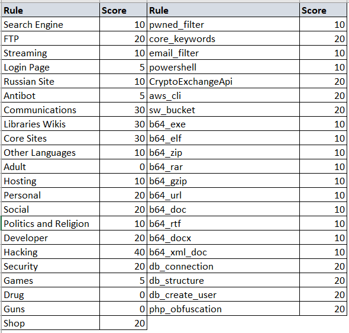
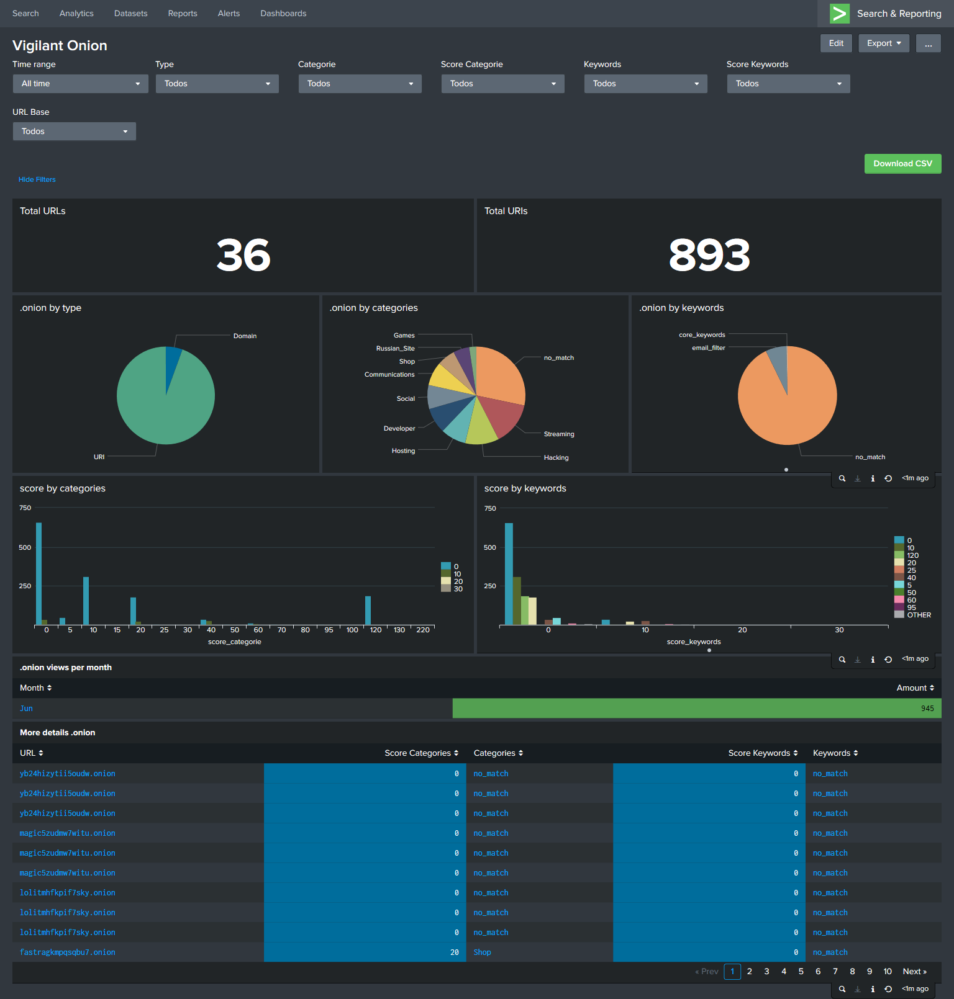

<p align="center">
  
</p>

<h1 align="center">VililantOnion</h1>
<p align="center">
  <a href="https://python.org/">
    
  </a>
    <a href="https://opensource.org">
    
  </a>
</p>

<p align="center">
  Crawler on tor network sites, searching for keywords.
</p>

## Introduction

VigilantOnion is complemented by Cyber Threat Intelligence teams so that they can monitor and obtain the best result of consultations carried out on the tor network.

In its first version using django for administration and creation of dashboards, there was a great difficulty in its use. In this new version, the consultations and methodology used to eliminate false positives are better.

## Methodology

To eliminate false positives and the level of assertiveness to be better, I am using yararule and notes, setting high values for rules that I find most relevant, as shown in the figure below:



These values are dynamic and can change according to your need.

## YaraRule

New yararules can be added to both the categories and keywords files, so you can eliminate false positives and have more pleasant results.

## Settings

Few things need to be changed in the settings file, however they are of great importance for using the script.

The fields below are for configuring the tor network proxy, if you are running a Windows script the port usually changes to `9051`

    server_proxy:  localhost
    port_proxy:  9050
    type_proxy:  socks5h

The timeout server field for you to determine the time to wait for requests, the longer the time, the longer the script can take.

    timeout:  30

The score server fields for you to determine the minimum score value for the URL to be crawled and sent to the syslog.

    score_categorie:  20
    score_keywords:  40

Some urls will be offline and it is difficult to know if they will return or not so I created a counter, that you can determine the maximum number of attempts, that once reached the script will no longer try to access that url.

    count_categories:  5

Whenever a crawler is made in the url it is saved with the date of that last scan, and you can determine a time limit of days between one scan and another in that same url.

    daystime:  10

And finally I don't use django anymore, now to view your results you need a syslog like Splunk or ELK, and you just have to define them here

    sendlog:  True
    logport:  5151
    logip:  "localhost"

## Use

Its use is simpler, you just need to have installed the [tor](https://itsfoss.com/install-tar-browser-linux/#:~:text=Install%20Tor%20browser%20launcher%20in,instructions%20on%20its%20download%20page.&text=All%20you%20have%20to%20do,folder%20and%20run%20the%20launcher.), and the python libraries, to do this run the command below:

    pip install -r requirements.txt

After the tor client and the installed libraries use the `--help` command to get details of its use.

```
➜  python3 observer.py -h
usage: observer.py [-h] [--config CONFIG] [--crawler] [--url URL] [--search]
                   [--engines ENGINES] [--find FIND] [--pastebin PASTEBIN]

VigilantOnion is a script to collect as many sites from the onion network as
possible and add them to a database. With all possible sites collected, a
crawler will be created so that we can monitor the search for keywords defined
by you.

optional arguments:
  -h, --help            show this help message and exit
  --config CONFIG, -c CONFIG
                        Configuration file in yaml format
  --crawler             Starts the TOR network URL crawler process.
  --url URL, -u URL     Specifies the URL to crawl.
  --search              Start the URL search process on the surface. Select a
                        framework where you want to search for urls.
  --engines ENGINES, -e ENGINES
                        Validates the available engines for searching URLs.
  --find FIND, -f FIND  Search for arguments on .onion network research sites
  --pastebin PASTEBIN   Search for .onion urls in pastebin paste.

You can also develop new framework so that the database has more urls onions.
```

For the script to work you need new urls, and for that I created a method that searches for urls on the surface, like the example below:

    python3.6 observer.py --config config/config.yml --search -e "gist,reddit,cybersecuritynews,discoverdarkwebservice"

You can also get URLs straight from `pastebin` files, like the example below:

    python3.6 observer.py --config config/config.yml --search --pastebin "s7TPZCKz,kSaYqtVX,0GYEEApe,3qkqyqiM,RfgBLg5Q,gtksBij4,FpPzQKHg,wB0uh00r,jDGJhQCC,q6DZ9U,ac2TnUjY,pv4xRWXQ,PgLUE7pF,9XW5Pc7R,hqyGMi7e,UZRM2z8y,7tQvV5CU,9JhVq3H3,Cb5HTydt,kMW5wp3N,v5Yq66sH,2q3SsR3a,gnd8jx97,QwSJYhYF,iNydrDfe"

After collecting some URLs, you can start the crawler process.
Remembering that the first one will take the longest because that is where the classification and categorization of the website content will be done.

    python3.6 observer.py --config config/config.yml --crawler

If you want to crawl a single URL, use:

    python3.6 observer.py --config config/config.yml --crawler --url "76qugh5bey5gum7l.onion"

## Output

The output of the result is json, and in the same format it is sent to the chosen syslog.

```
{
  "lastscan": "2020-06-29",
  "id": 10760,
  "type": "URI",
  "url": "lolitmhfkpif7sky.onion",
  "title": "Lolita Club",
  "baseurl": "vyqi2nm36otufrgg.onion",
  "status": "Online",
  "count_status": 0,
  "source": "Script",
  "categorie": [
    {
      "full_categorie": [
        "no_match"
      ],
      "score_categorie": 0
    }
  ],
  "keywords": [
    {
      "full_keywords": [
        "no_match"
      ],
      "score_keywords": 0
    }
  ],
  "discovery_date": "2020-06-29 14:24"
}
```

I use splunk, and you can make your dashboard look like mine:



## Help

Feel free to fork or open an issue to collaborate with the project.
